# Projeto `Amnésia`

# Descrição Resumida do Projeto/Jogo

Amnésia é um jogo single player do tipo escape room. Nele, o jogador é desafiado a concluir puzzles baseados em abstrações e interações com objetos inicialmente desconhecidos dispostos numa sala.

Conforme o jogador investiga esses objetos, ele adquire as interfaces necessárias para interagir com eles e, a partir disso, é possível inferir a ordem correta de interações a serem feitas para que o puzzle da sala seja concluído.

Quando isso acontece, o jogador avança para a próxima sala do jogo e segue nesse processo de aprendizado contínuo!

# Equipe
* `Enzo Guimarães Campos` - `247069`
* `Luísa Freitas Colafati` - `247249`

# Arquivo Executável do Jogo

> [amnesia.jar](https://github.com/Projetos-Enzo-e-Luisa-POO/projectsPOO/blob/main/amnesia/amnesia.jar)

# Slides do Projeto

## Slides da Prévia
> [Apresentação Prévia](https://docs.google.com/presentation/d/1KBlFpWyvK7-cOQYOfY1X7e4mozWhmyj8pmOMxseyHHM/edit?usp=sharing)

## Slides da Apresentação Final
> [Apresentação Final](https://docs.google.com/presentation/d/1OaMNmC3FvYEbifLXxK6CaPXF228vnRcS-5bQyYWqcU8/edit?usp=sharing)

# Relatório de Evolução

## Nascimento da ideia do jogo

A ideia do jogo originou-se num brainstorm a respeito de conceitos básicos de Orientação de Objetos (OO), como abstração e interfaces, e de como poderíamos ilustrá-los num jogo lúdico e educativo.

Inicialmente, pensamos em desenvolver três salas/puzzles que abusavam das várias possibilidades que a arquitetura planejada ofereceria: criação de vários objetos e interfaces; definição de diferentes objetivos e caminhos a serem seguidos numa mesma sala; “adaptabilidade” do jogo para dar ao player a liberdade de escolher como ele desejaria interagir com o ambiente ao seu redor.

## Planejamento da arquitetura e da interface gráfica

Após algumas pesquisas iniciais, também decidimos usar o framework LibGDX no desenvolvimento do projeto. Mas como ele era desconhecido para nossa dupla e nós ainda não tínhamos praticado a construção de interfaces gráficas em Java, achamos mais interessante investir na construção de uma arquitetura mais focada no backend e no funcionamento interno do jogo.

Desde as primeiras reuniões de planejamento de arquitetura, definimos que nossas principais features seriam:
- Inicialização do jogo a partir de arquivos .csv;
- Customização de binds (vínculos entre teclas do teclado e comandos do jogo) num menu inicial;
- Implementação de uma função de Save do estado do jogo, que acarretaria a criação de um banco de flags que armazenaria as configurações atuais do jogo num arquivo .csv, a ser usado na inicialização do jogo;
- Implementação de um observador geral do jogo chamado “StoryTeller”, que seria responsável pela progressão do jogo, interações com o jogador e transições entre salas;
- Implementação da arquitetura MVC, com ênfase no Model e nas diversas interfaces que cada componente interagível da sala implementaria, bem como nas suas interações com o protagonista e/ou sala do jogo

## Primeiro diagrama geral do funcionamento do jogo

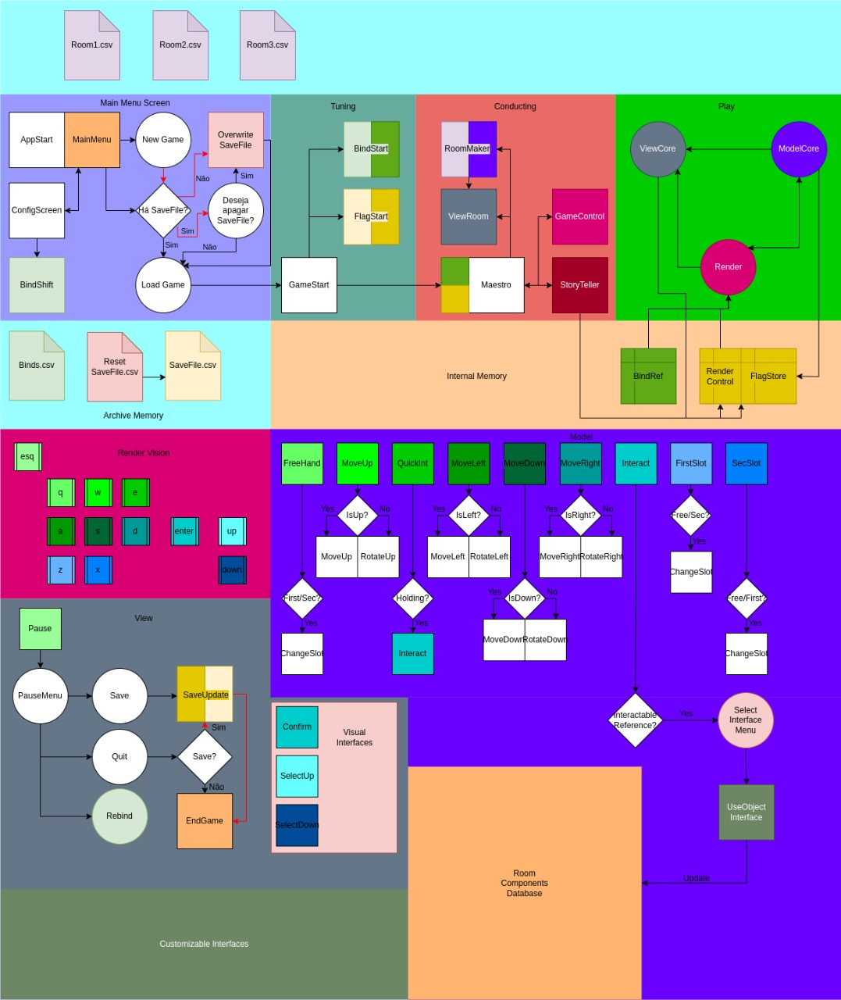

## Diagrama de herança e relações dos primeiros elementos implementados no Model

--

# Diagramas finais

Ao final do projeto, fizemos dois diagramas contemplando toda a arquitetura implementada.

O primeiro deles mostra as relações de herança e implementação de interfaces no jogo:

<inserir diagrama aqui>

Já o segundo mostra as relações entre classes, dadas por atributos, parâmetros, retornos de métodos e/ou chamadas runtime:

<inserir diagrama aqui>

Recomendamos o acesso a esses diagramas apenas para consultas direcionadas em que você queira saber especificamente de que classes uma determinada subclasse herda, ou então com que classes/interfaces outra classe se relaciona.

Falamos isso porque, dada a complexidade do projeto, seu diagrama final acabou ficando bem poluído.

## Primeiras dificuldades

### *Interface gráfica*

Logo nos deparamos com o primeiro impasse no desenvolvimento do projeto: nosso Model estava praticamente pronto, mas não conseguíamos testá-lo pois ainda não tínhamos estruturado o básico da interface gráfica do jogo.

Nesse ponto, voltamos nossas atenções para o frontend. Percebendo que levaria um bom tempo para aprendermos funcionalidades mais avançadas do framework libGDX, optamos por usar seus recursos mais simples, que já havíamos estudado, para construirmos as interfaces gráficas mínimas necessárias para que o jogo fosse executável e testável.

Foi aí que surgiu a estruturação das classes Curtain, Menu, Settings, Loading e Level, que chamamos internamente de “framework backbone" (“espinha dorsal do framework”).

### *Complexidade das salas do jogo*

Ao mesmo tempo, percebemos que a criação de uma sala despendia muito tempo, pois ela abarngia a criação de interfaces, elementos interagíveis e, principalmente, das imagens características de cada objeto/elemento do jogo que decidimos fazer a mão, a fim de agregarmos valor à customização e exclusividade de nossa interface gráfica.

Decidimos, então, focar nossos esforços na construção de uma sala “modelo”, que serviria somente para colocarmos em prática todos os recursos implementados. Isto é, ela foi nossa “proof of concept” (POC) sobre a arquitetura planejada para o jogo.

## Features adaptadas e/ou não finalizadas completamente

### *Leitura e escrita de arquivos*

Num primeiro momento, implementamos métodos de algumas classes nativas do Java em nossa própria classe de leitura e escrita de arquivos.

Dias depois, no entanto, descobrimos que o framework libGDX também possui funções nativas para fazer a leitura e escrita de arquivos, de mais fácil implementação que os métodos do Java - a quantidade de linhas de código foi reduzida consideravelmente, sem contar que as funções do libGDX já tratam exceções que podem surgir duma manipulação indevida de arquivos, retornando uma excpection customizada (GdxRuntimeException).

Por isso, acabamos refatorando nossos códigos de leitura e escrita de arquivo para substituirmos as classes nativas do Java pelas funções do libGDX - retrabalho que nos tomou tempo útil de desenvolvimento.

### *Dimensionamento de imagens*

Ao longo do desenvolvimento, também tivemos retrabalhos na renderização de imagens do jogo. Tivemos que testar diferentes formas de exibí-las na tela até que encontrássemos uma que nos permitisse ajustar as imagens às dimensões dinâmicas da tela do jogo, que mudavam a cada resize de janela.

### *Problema do cast*
Sem dúvidas, esse foi nosso maior desafio, cuja solução se deu através da criação de uma classe castCenter, detalhada <nesse destaque>

### *Ausência da função de Save do jogo*

Conseguimos implantar o save de configurações somente na tela de Settings, que permitiu a alteração de binds do jogo.

Mas ficou para trás a função de save do estado atual do jogo, para que ele pudesse ser recuperado numa próxima partida. Na verdade, chegamos a desenvolver grande parte dessa função, mas não tivemos tempo suficiente para registrar o inventário do jogo em nosso banco de flags, nem para salvarmos uma lista com as interfaces descobertas pelo player.

# Destaques de Orientação a Objetos

## Diagrama de classes usadas no projeto


## Encapsulamento da Room

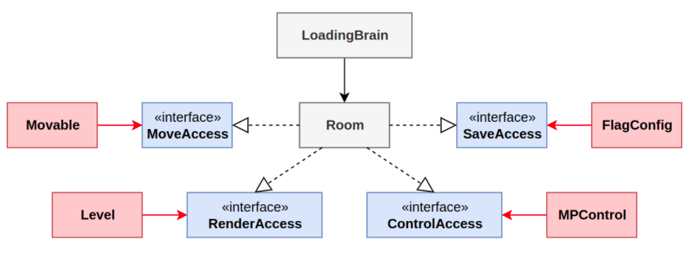

## Herança nos elementos da sala (comentar ID)

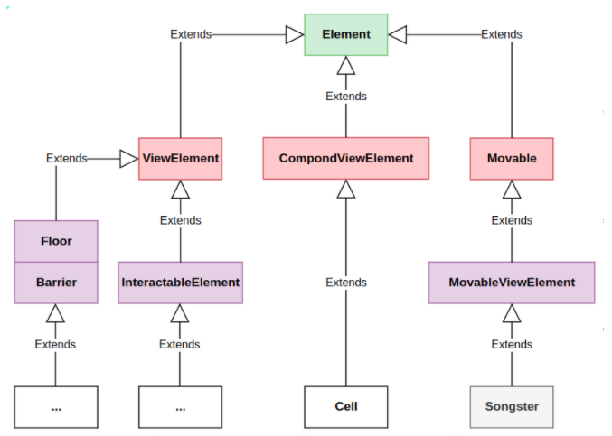

# Destaques de código

## Leitor de arquivos e tratamento de exceções

Como explicado anteriormente nesta documentação, optamos por implementar funções nativas do libGDX que fazem a leitura e escrita de arquivos em nossa classe de manipulação de arquivos .csv chamada ```FileManagment```.

Como as funções do libGDX retornam uma exception customizada (```GdxRuntimeException```) caso o libGDX tenha problemas no acesso e/ou manipulação de um arquivo, nós também decidimos criar exceptions customizadas com mensagens mais explicativas sobre o tipo de problema identificado pelo libGDX, a depender do tipo de ação que tentamos executar com um dado arquivo.

Ao todo, foram criadas 3 exceptions customizadas: ambas extendem a classe Excpetion, nativa do Java, e chamam o construtor da classe Excpetion, passando uma mensagem personalizada sobre o erro como parâmetro, em seus próprios construtores.

Tal estrutura está exemplificada nos seguintes trechos de código referentes:

1. Método ```getFileContent``` da classe ```FileManagment```, que lê e retorna o conteúdo de um arquivo separado por vírgulas:

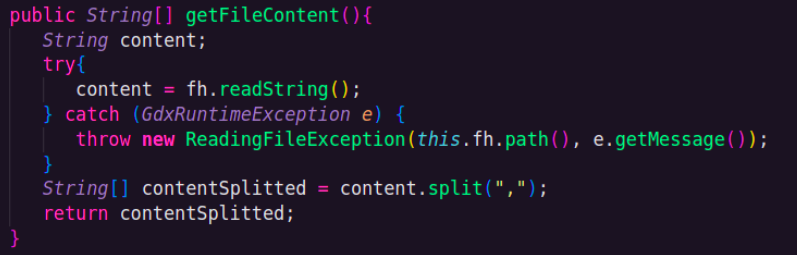

2. Exception customizada disparada em caso de erros na execução do método ```getFileContent```:

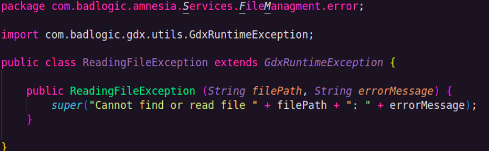

## Settings e BindDepot

No menu inicial do jogo, temos uma tela de configurações de binds (Settings), que mostra uma lista com todos os comandos de jogo disponíveis e o valor atual que estamos associando a ele, o qual, na prática, é uma tecla do teclado que irá acionar um determinado comando do jogo durante sua execução (chamamos esse vínculo de bind).

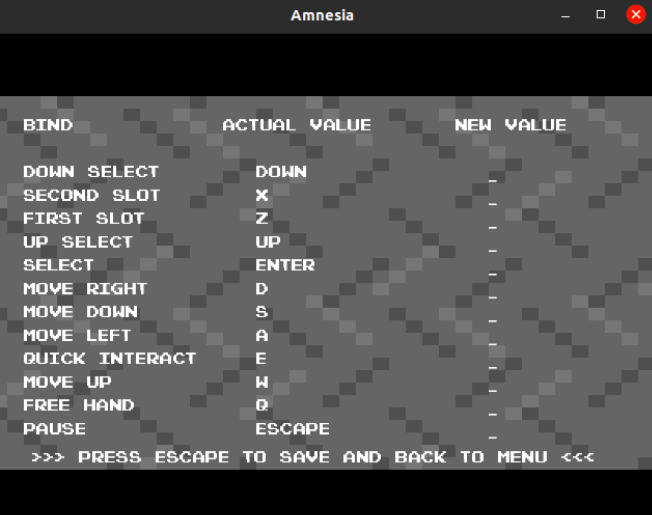

Todas essas informações estão sendo lidas do nosso arquivo ```KeyBindValues.csv``` através da classe ```BindDepot```.

Além disso, temos caixas de texto disponíveis na tela para que o jogador possa alterar uma bind do jogo. Caso ele faça uma alteração e pressione a tecla escape, que é a tecla padrão que deve ser usada para sair da tela de Settings e voltar ao menu inicial do jogo, acionamos uma outra classe chamada ```BindConfig``` para salvar as alterações de binds no arquivo ```KeyBindValues.csv```.

Vale também lembrar que esse arquivo é usado durante a execução do jogo na classe ```Level```, para verificarmos se uma tecla digitada pelo usuário está no arquivo ```KeyBindValues.csv``` e, portanto, é uma bind do jogo.

Então toda alteração de binds feita da tela de Settings será automaticamente refletida na próxima partida do jogo. 

## castCenter

### Problema do cast

A proposta do Amnesia gira em torno da ideia de aprendizado progressivo do protagonista do jogo a respeito de interfaces necessárias para que ele interaja com elementos inicialmente desconhecidos espalhados pelas salas do jogo.

Trata-se de uma ideia abstrata e genérica que vinha com um problema: como chamar um método de assinatura desconhecida na interface genérica que deveria conter um elemento na matriz da sala?

Após ponderar manter uma classe-memória com um vetor de objetos do jogo, cada um com suas classes e métodos específicos, entendemos que o tamanho desse vetor e a complexidade dessa classe tenderiam a crescer exponencialmente com as expansões do jogo.

Por isso, achamos melhor fazer os casts de modo controlado e centralizado, e o castCenter foi a materialização dessa solução.

### Solução

Através de uma string “action” que contém o nome do método desejado, declarado por uma interface de nome previsível (action + “I”), e de sobrecarga de métodos, pudemos prever diferentes assinaturas de métodos genéricos no que diz respeito a parâmetros e tipos de retorno.

Com isso, o castCenter conseguiu buscar o método na interface desejada, e fazer um cast genérico para qualquer classe, prevendo os possíveis erros caso um método incoerente para a interface ou objeto em questão fosse chamado.

### Código implementado

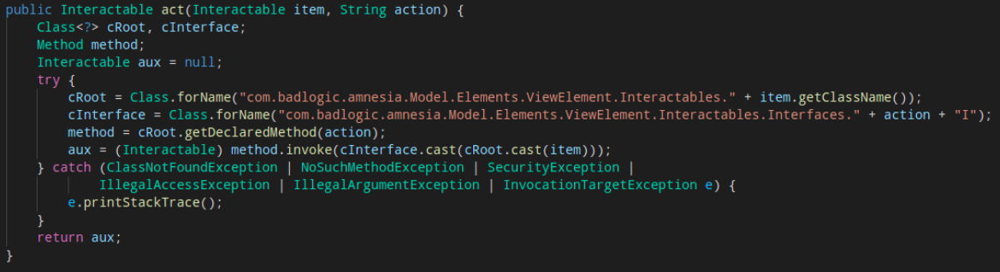

# Destaques de Pattern

## Facade

### *Contexto de aplicação*

Usamos o Facade para centralizar na classe MPControl todos os métodos do Model que, de fato, executam um comando do jogo. Nesse sentido, é de responsabilidade do MPControl buscar tais métodos nas classes que representam o protagonista e a sala do jogo.

Então, resta ao Level (nossa classe de interface gráfica) apenas renderizar as imagens do jogo na tela e monitorar as teclas de teclado digitadas pelo jogador.

Caso ele detecte o clique numa bind do jogo, o Level irá apenas delegar a execução do comando associado a essa bind ao MPControl, como ilustra o diagrama abaixo:

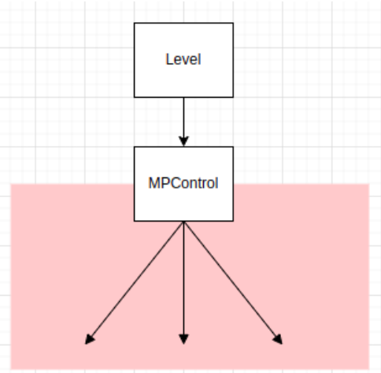

### *Exemplo de código*

## Singleton

### *Contexto de aplicação*

Usado nas seguintes classes de inicialização do jogo, a fim de que elas fossem instaciadas somente uma vez e depois reutilizadas a cada nova partida e/ou construção de uma nova sala durante a partida atual:
- BindDepot
- FlagDepot
- RoomBuilder

### *Exemplo de código*

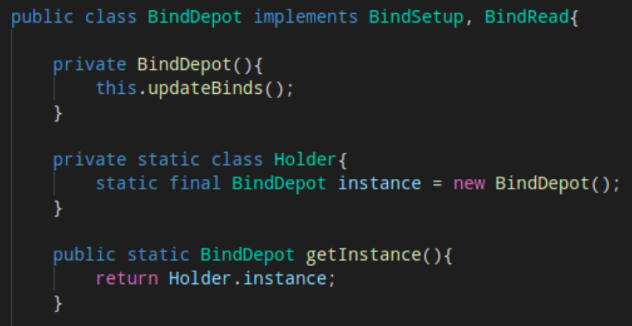

## Strategy

### *Contexto de aplicação*

Usamos o Strategy para que cada objeto do jogo tenha, em sua classe, um método de renderização chamado ```render```, com diferentes assinaturas e implementações a depender dos requisitos que cada objeto possui atrelado a sua renderização na tela.

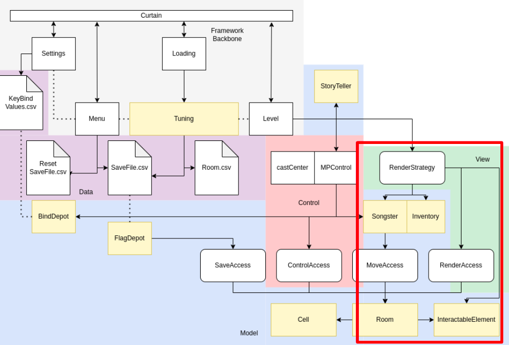

### *Exemplo de código*

Função de renderização de um elemento interagível na tela do jogo:

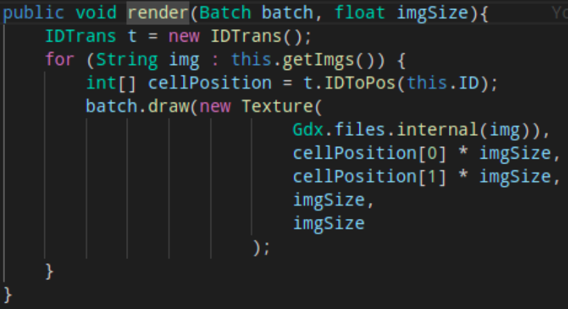

## Menções honrosas: patterns não desenvolvidos tradicionalmente

### Factory

### *Contexto de aplicação*

Usado na inicialização de sala do jogo, quando lemos o conteúdo de um arquivo .csv e traduzimos cada caractere obtido para a instância de uma classe representativa de um tipo de objeto a ser disposto na sala em inicialização.

Atualmente, a associação entre um caractere e uma instância de classe está hardcodada em nosso método ```pleaceableFactory```, que implementa o factory pattern.

### *Exemplo de código*

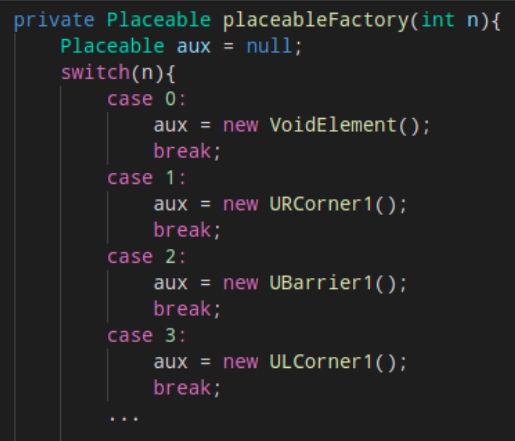

### Memento

### *Contexto de aplicação*

### *Exemplo de código*

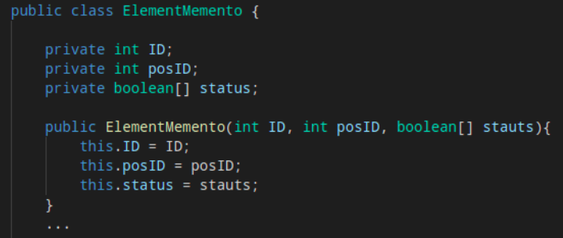

### Observer

### *Contexto de aplicação*

Por mais que não tenhamos tido tempo de finalizar nossa classe StoryTeller como pensado inicialmente, projetamos ela com base no padrão Observer, uma vez que a ideia por trás do StoryTeller seria justamente que ele deveria observar o estado do jogo e nosso banco de flags o tempo todo, para interagir com o jogador através do print de mensagens na tela e também ficar responsável pelo próprio controle de estados do jogo.

### *Exemplo de código*

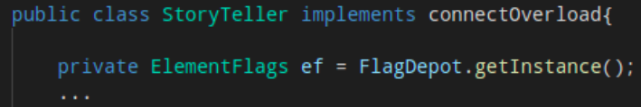

# Conclusões e Trabalhos Futuros

Nossa maior lição foi perceber a importância de manejar melhor nosso tempo, bem como de adaptar melhor nossas ideias para o tempo disponível de desenvolvimento do projeto.

Ter consciência e humildade para reconhecer nossas limitações técnicas também é de suma importância para o projeto. Saber exatamente quais são as ferramentas disponíveis para seu desenvolvimento desde o início direciona melhor o pensamento arquitetural, permitindo a estruturação detalhada dos componentes do projeto ou, ainda, a consideração da curva de aprendizado necessária para que consigamos usar uma nova ferramenta no projeto.

# Documentação dos Componentes

## Diagrama Geral da Arquitetura do Jogo

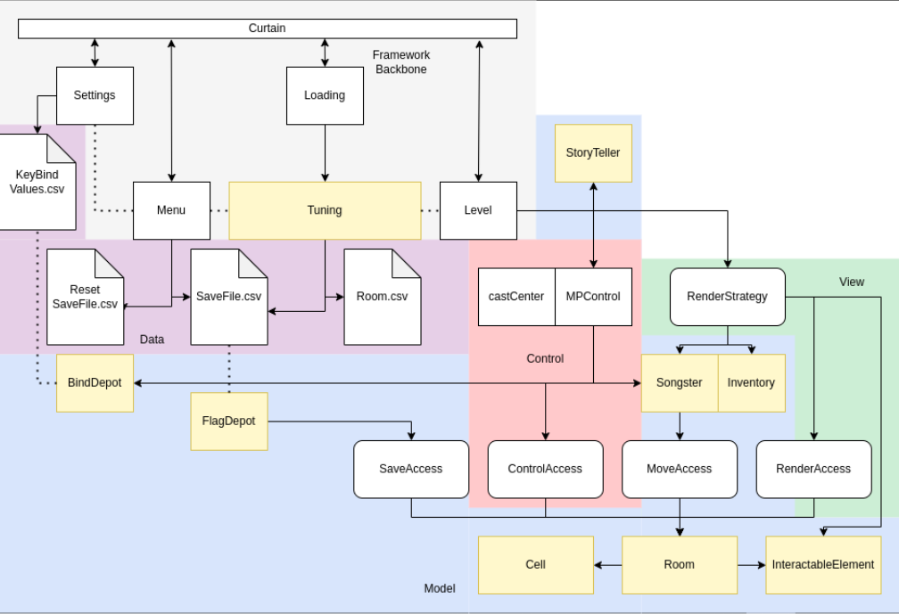

## Diagrama Geral de Componentes

> Se você adotou componentes de software, apresente a documentação de componentes conforme o modelo.

## Componente `<Nome do Componente>`

> Resumo do papel do componente e serviços que ele oferece.


**Ficha Técnica**
item | detalhamento
----- | -----
Classe | `<caminho completo da classe com pacotes>` <br> Exemplo: `pt.c08componentes.s20catalog.s10ds.DataSetComponent`
Autores | `<nome dos membros que criaram o componente>`
Interfaces | `<listagem das interfaces do componente>`

### Interfaces

Interfaces associadas a esse componente:


Interface agregadora do componente em Java:

~~~java
public interface IDataSet extends ITableProducer, IDataSetProperties {
}
~~~

## Detalhamento das Interfaces

### Interface `<nome da interface>`

`<Resumo do papel da interface.>`

~~~
<Interface em Java.>
~~~

Método | Objetivo
-------| --------
`<id do método em Java>` | `<objetivo do método e descrição dos parâmetros>`

## Exemplo:

### Interface `ITableProducer`

Interface provida por qualquer fonte de dados que os forneça na forma de uma tabela.

~~~java
public interface ITableProducer {
  String[] requestAttributes();
  String[][] requestInstances();
}
~~~

Método | Objetivo
-------| --------
`requestAttributes` | Retorna um vetor com o nome de todos os atributos (colunas) da tabela.
`requestInstances` | Retorna uma matriz em que cada linha representa uma instância e cada coluna o valor do respectivo atributo (a ordem dos atributos é a mesma daquela fornecida por `requestAttributes`.

### Interface `IDataSetProperties`

Define o recurso (usualmente o caminho para um arquivo em disco) que é a fonte de dados.

~~~java
public interface IDataSetProperties {
  public String getDataSource();
  public void setDataSource(String dataSource);
}
~~~

Método | Objetivo
-------| --------
`getDataSource` | Retorna o caminho da fonte de dados.
`setDataSource` | Define o caminho da fonte de dados, informado através do parâmetro `dataSource`.

# Plano de Exceções

## Diagrama da hierarquia de exceções
> Elabore um diagrama com a hierarquia de exceções como detalhado a seguir.


## Descrição das classes de exceção

> Monte uma tabela descritiva seguindo o exemplo:

Classe | Descrição
----- | -----
DivisaoInvalida | Engloba todas as exceções de divisões não aceitas.
DivisaoInutil | Indica que a divisão por 1 é inútil.
DivisaoNaoInteira | Indica uma divisão não inteira.

